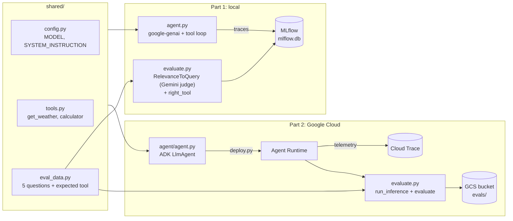

# Architecture

One travel assistant with two tools, evaluated at two scales. The agent, the tools, the system instruction and the evaluation questions are shared, so the only thing that changes between the parts is the platform.

## Shared code (`shared/`)

| File | Purpose |
|---|---|
| `config.py` | `MODEL` (the one place to change the model) and `SYSTEM_INSTRUCTION` |
| `tools.py` | `get_weather(city)` and `calculator(expression)`. Fixed fake data, no network, so every run is repeatable. `calculator` parses with `ast` and only allows numbers and `+ - * / **`. |
| `eval_data.py` | Five questions, each with the tool the agent should use. The bicycle question fails on purpose: the answer is right, but the agent skips the calculator because the instruction says "complex arithmetic". |

## Part 1: MLflow (local)

- **Agent** (`part1_mlflow/agent.py`): calls Gemini through `google-genai` with an explicit tool loop (automatic function calling turned off) so every step is visible.
- **Tracing**:
  - `mlflow.gemini.autolog()` records each Gemini call as an LLM span.
  - `@mlflow.trace(span_type="AGENT")` wraps the entry point, so one question is one trace.
  - The tools are wrapped with `mlflow.trace(span_type="TOOL")`, because autolog does not record tool calls.
- **Store**: SQLite at `mlflow.db`, served by `./demo.sh mlflow-ui` on port 5000.
- **Scorers** (`part1_mlflow/scorers.py`):
  - `RelevanceToQuery(model="vertex_ai:/<MODEL>")`, an MLflow built-in LLM judge that runs Gemini on the Agent Platform. `setup()` sets `VERTEX_PROJECT` and `VERTEX_LOCATION` for it.
- **Model access**: `genai.Client(enterprise=True, project=..., location="global")` with Application Default Credentials. No API key. The client is created lazily, so importing the code makes no network calls and the offline tests need no credentials.
  - `travel_guidelines`, MLflow's `Guidelines` judge with our own criteria (`JUDGE_GUIDELINE` in `shared/config.py`), also on Gemini. The judge only sees the question and answer, not tool results, so the guideline must be checkable from those alone.
  - `right_tool`, a `@scorer` that reads the trace and checks for a TOOL span with the expected name.
- **MLflow pages the demo fills**:
  - **Sessions**: `run_agent.py` tags its three traces with one `session_id` (`mlflow.update_current_trace`).
  - **Datasets**: `dataset.py` keeps the `devfest-travel-questions` evaluation dataset in sync with `shared/eval_data.py`; `evaluate()` reads from it, so runs link to it.
  - **Judges**: `evaluate.py` registers the two LLM judges. `right_tool` cannot be registered outside Databricks.
  - **Review**: `review.py` creates the `devfest-review` review queue (`mlflow.genai.review_queues`, experimental) with two review questions (label schemas `used_right_tool`, `expected_answer`), adds the latest evaluation run's traces, logs scripted example human reviews (source `HUMAN`, metadata `example=true`) and marks each item complete.
- **Quality gate**: `evaluate.py --gate` exits with an error if `right_tool` drops below 80% or relevance drops below 100%. 80% leaves room for exactly the one deliberate failure.

## Part 2: Gemini Enterprise Agent Platform

- **SDK**: `google-cloud-agentplatform` (`import agentplatform`). This is the package that replaced `vertexai.Client` after the April 2026 rename.
- **Agent** (`part2_agent_platform/agent/agent.py`): an ADK `LlmAgent` with the same model, instruction and tools. The model is `Gemini(model=MODEL, client_kwargs={"enterprise": True, "location": "global"})`, because the agent runs in `europe-west1` but the model is only served from `global`.
- **Deploy** (`deploy.py`): `client.runtimes.create(agent=AdkApp(agent=root_agent), config={...})`.
  - Telemetry to Cloud Trace is turned on with the `GOOGLE_CLOUD_AGENT_ENGINE_ENABLE_TELEMETRY=true` env var.
  - The agent runs as the Terraform-managed service account.
  - `requirements` is the `agent-runtime` dependency group exported from `uv.lock`, so the cloud runs exactly the tested versions.
  - `shared/` and `part2_agent_platform/` are uploaded as `extra_packages`.
  - The resource name is saved to `.agent_resource`.
- **Traffic** (`generate_traces.py`): the five eval questions plus two extra ones, sent with `async_stream_query`.
- **Evaluation** (`evaluate.py`):
  - `client.evals.run_inference(agent=..., src=dataframe)` runs the questions through the deployed agent.
  - `client.evals.evaluate(...)` then scores the answers with the managed judges `FINAL_RESPONSE_QUALITY` and `TOOL_USE_QUALITY`, our own `travel_guidelines` judge (an `LLMMetric` with the same guideline as Part 1), and a custom `right_tool` code metric that mirrors Part 1.
  - `TOOL_USE_QUALITY` refuses to score a row with no tool calls (400 for the bicycle row). The SDK logs it and leaves the row out of that metric.
  - Results are written to `gs://<bucket>/evals`.
- **Settings** (`settings.py`): every script reads project, region, bucket and service account from `terraform output`, so Python and Terraform cannot drift apart.

## Infrastructure (`terraform/`)

Two independent stacks. State is in GCS (`gs://<project>-tfstate`, versioned), one prefix per stack:

| Stack | Resources | Billing |
|---|---|---|
| `gemini_api_key/` (optional) | `apikeys`, `generativelanguage` and `secretmanager` APIs. Create mode: an API key restricted to the Gemini API, the `gemini-api-key` secret, and a version written with `secret_data_wo` (not stored in state). Existing mode: reads the secret as data and creates nothing. | Needed for Secret Manager |
| `agent_platform/` | 11 APIs (including `observability` for trace storage and `apphub` for the Topology view), a bucket (uniform access, `force_destroy`), the `devfest-agent` service account and its roles | Needed |

The agent service account has the following roles:

| Role | Why |
|---|---|
| `roles/aiplatform.user` | Call Gemini and the Agent Platform APIs. This is the only role the docs list. |
| `roles/cloudtrace.agent` | Write traces |
| `roles/logging.logWriter` | Write logs |
| `roles/monitoring.metricWriter` | Write metrics |
| `roles/serviceusage.serviceUsageConsumer` | Use the enabled APIs |
| `roles/storage.objectUser` | Read and write objects in the demo bucket only |

`scripts/setup-gemini-secret.sh` chooses the key stack mode on every run, so repeat runs are stable:

| Situation | Mode | Result |
|---|---|---|
| Secret is in this stack's state | create | Terraform keeps managing it |
| Secret exists in the project, not in state | existing | Used as data. No key or version is created, and `infra-down` leaves it alone. |
| Secret does not exist | create | Key, secret and version are created |

Default region: `europe-west1`. Both Agent Runtime and evaluation support it.
